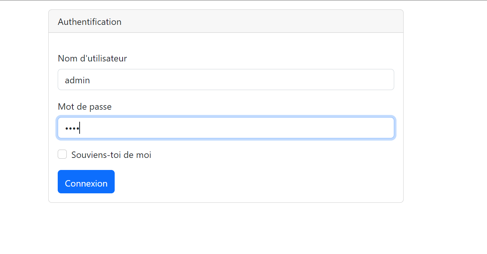
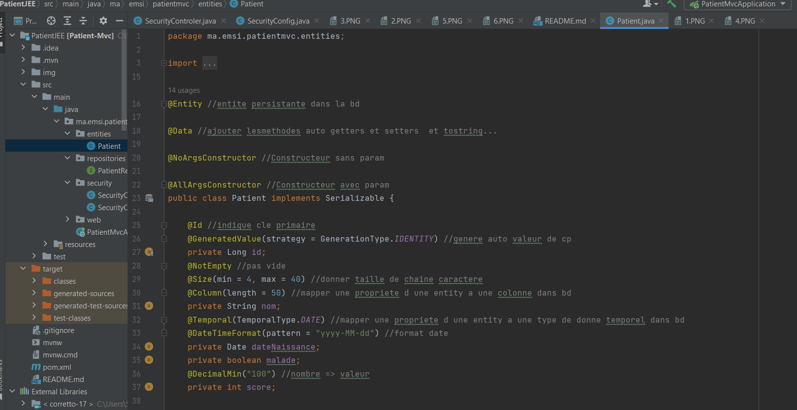
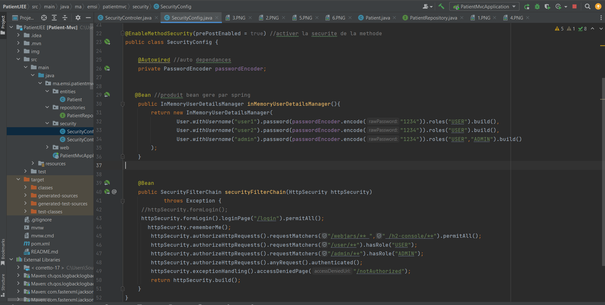

<h3>Projet géstion de patient JEE </h3>

Authentication autant que user1

home user1

Authentication admin

Interface de patient autant qu'admin

Supprimer Patient

code patient

code patient mvc

x

code repository

code security

code application prop

